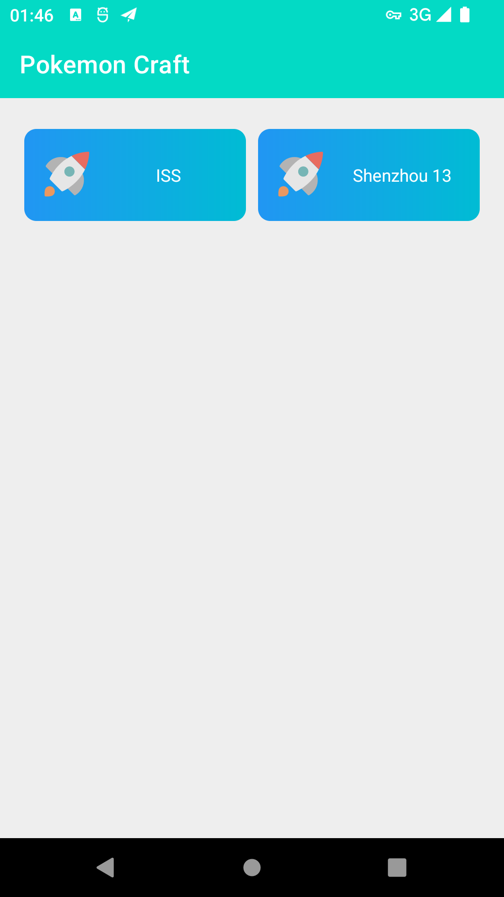
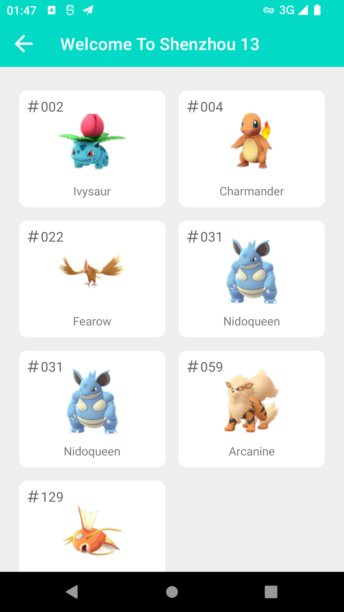
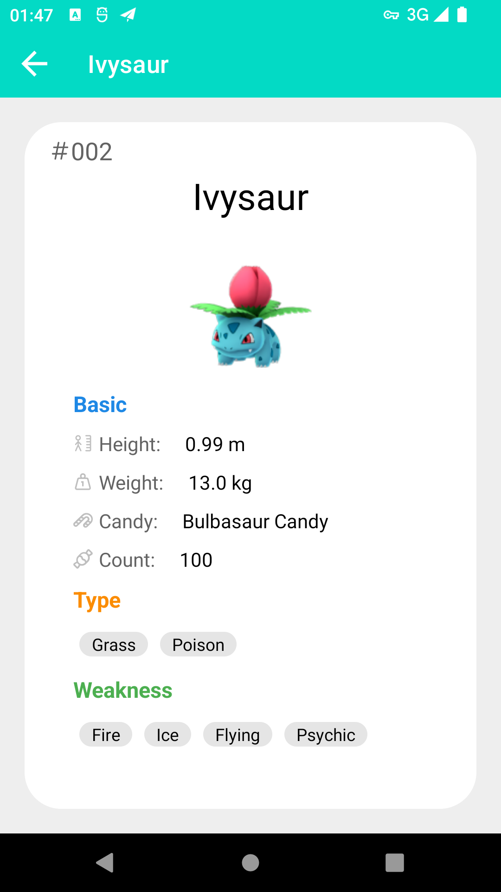

## Android SpacePokemon

A pokemon app base on MVVM architecture with Android Jetpack.

This repository is a interview project with specified data source to display pokemon list in Android.

## Tech Stack

Kotlin with coroutine

Hilt - Dependency injection

Android Jetpack components

- Lifecycles -  Holds the information about the lifecycle state of a component (like an activity or a fragment) and allows other objects to observe this state.

- LiveData - Build data objects that notify views when the underlying data changes.

- ViewModel -  Store and manage UI-related data in a lifecycle conscious way.

- ViewBinding - Easy to find views and interacts with views

- Room - Access app's SQLite database with in-app objects and compile-time checks.

- Navigation - Navigation between Activity/Fragment

Glide - Image loading

OkHttp - Baisc http/https request client

## Screenshots

## Apk for test

[Click here to downlod test app](apk/pokemonspace-debug.apk?raw=1)

## Todo

Logic optimize

...

## Reference

[sunflower-  Android development best practices with Android Jetpack ]( https://github.com/android/sunflower)